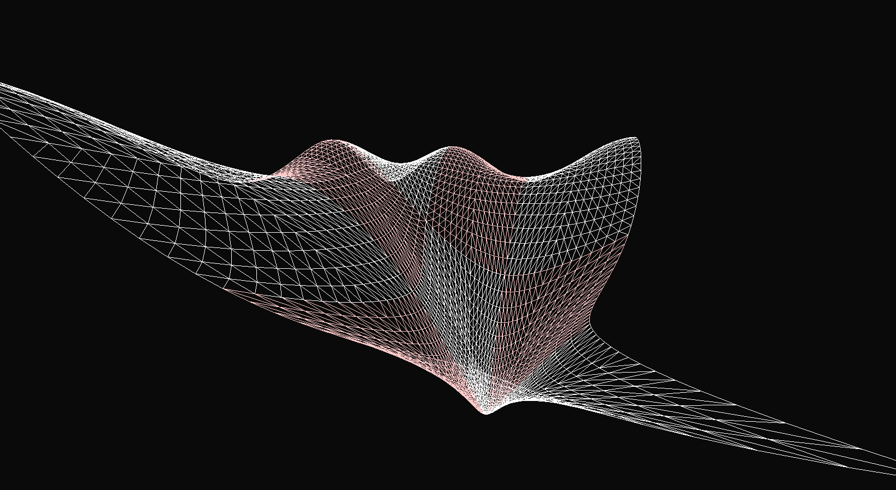

# NURBS

NURBS implementation + renderer with rational bezier patches tesselated on GPU.

NURBS related code is in bezier.c file. The renderer is using DirectX, so it's works only on Windows (see build.bat for cl commands)

key commands to move camera in the viewer:
- WASD - move camera horizontally
- E/Q - move camera up/down.
- F1 - wireframe view.
- F2 - use clamped uniform knots for the same control points.

